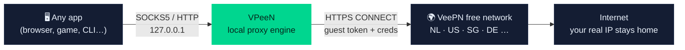

<div align="center">


# 🛡️ VPeeN

**Turn the free VeePN browser-extension network into a full system-wide VPN — no login, no subscription, no desktop app.**

[](LICENSE)
[](#-quick-start)
[](https://www.python.org/)
[](../../releases)
[](../../stargazers)
[](../../issues)

*[English](#-why-vpeen) · [فارسی](#-راهنمای-فارسی)*


</div>

---

## 💡 Why VPeeN?

The **VeePN Chrome extension** is free, needs **no account**, and tunnels your browser traffic through
its global proxy network. VPeeN reverse-engineered that exact protocol and gives the same tunnels to
**your entire operating system** — through a clean, modern, VPN-style desktop app.

> One click → your real IP hides behind Amsterdam, Virginia, Singapore, and more.
> Chrome can stay closed. VPeeN talks to the VeePN network directly.



## ✨ Features

| | Feature | Details |
|---|---|---|
| 🔌 | **One-click tunnel** | Big, honest connect button — green to connect, red to disconnect |
| 🌍 | **Location picker** | All free VeePN locations with auto-select *Optimal* mode |
| 🕵️ | **IP monitor** | Real IP vs. exit IP, side by side, refreshed live |
| ⏱️ | **Session timer** | Exactly how long you have been protected |
| 🖥️ | **System-wide proxy** | One switch sets (and cleanly restores) your OS proxy |
| 📜 | **Full activity log** | Color-coded, autoscrolling, exportable to a file |
| ⚙️ | **Settings tab** | Ports, bind address, theme, auto-connect, session reset |
| 🚀 | **Zero dependencies at runtime** | Core engine is pure Python standard library |
| 🙈 | **No account** | Anonymous guest tokens — the same trick the extension uses |
| 🔁 | **Self-healing tunnels** | Round-robin across servers, automatic retry on failure |

<div align="center">

| Main screen | Activity log | Settings |
|:---:|:---:|:---:|
|  |  |  |

</div>

## 🚀 Quick Start

### Option 1 — Ready-made binaries (easiest)

Grab a build from [**Releases**](../../releases):

| File | OS | Run |
|---|---|---|
| `VPeeN-Windows.zip` | Windows 10/11 | unzip → `VPeeN.exe` |
| `VPeeN-macOS.zip` | macOS 10.13+ | unzip → `VPeeN.app` *(right-click → Open the first time)* |
| `VPeeN-Linux.tar.gz` | Linux x64 | extract → `./VPeeN` |

> Linux note: the bundled build uses the runner's Tk. If fonts look odd on your distro,
> prefer Option 2 — it uses your system Tk with perfect font rendering.

### Option 2 — Run from source

```bash
git clone https://github.com/SirBNL/VPeeN.git
cd VPeeN
pip install -r requirements.txt
python main.py
```

That's it. The GUI boots, fetches free locations, shows your real IP — press **CONNECT**.

### Option 3 — Headless CLI (no GUI)

```bash
python -m vpeen.cli list            # show free locations
python -m vpeen.cli test nl         # full chain test: token → server → exit IP
python -m vpeen.cli run --region us-va   # local SOCKS5 :1080 + HTTP :8080
python -m vpeen.cli export nl       # print raw upstream proxy config
```

Then point any app at:

```
SOCKS5 :  socks5://127.0.0.1:1080
HTTP   :  http://127.0.0.1:8080
```

## ⚙️ How it works

VPeeN reproduces the VeePN browser-extension protocol end to end:

1. **Domain discovery** — resolves a live API base from rotating seed domains,
   so the app keeps working when endpoints move.
2. **Anonymous session** — `POST /v3/launch/` returns a guest access token. No login, ever.
3. **Locations** — `GET /v3/location/extension/` lists every region and marks the free tier.
4. **Servers + credentials** — `POST /v3/server/list/` returns HTTPS-CONNECT proxies with
   per-session username/password.
5. **Local interface** — VPeeN listens as a standard **SOCKS5** and **HTTP** proxy on `127.0.0.1`,
   then relays every connection through the VeePN tunnel (TLS inside TLS).
6. **System proxy** — optionally flips the OS proxy switch (Windows registry / macOS networksetup /
   GNOME gsettings) and restores the previous state on exit.

📄 The full reverse-engineering notes live in [RESEARCH.md](RESEARCH.md).

## 🏗️ Build from source

```bash
pip install pyinstaller
pyinstaller vpeen.spec --noconfirm
```

- **Windows** → `dist/VPeeN.exe`
- **macOS** → `dist/VPeeN.app`
- **Linux** → `dist/VPeeN`

Every push to `main` is built automatically for all three platforms by
[GitHub Actions](.github/workflows/build.yml) — see the
[Actions tab](../../actions) for artifacts, and tags (`v*`) produce releases.

## 📁 Project structure

```
VPeeN/
├── main.py                # GUI launcher
├── vpeen/
│   ├── gui.py             # CustomTkinter interface (Connect / Logs / Settings)
│   ├── core.py            # background asyncio core + GUI event bridge
│   ├── api.py             # VeePN API client (domain rotation, tokens, servers)
│   ├── upstream.py        # HTTPS-CONNECT upstream tunnels
│   ├── localproxy.py      # local SOCKS5 + HTTP proxy servers
│   ├── systemproxy.py     # OS proxy switch (Win / macOS / GNOME)
│   ├── settings.py        # persistent app settings
│   ├── cli.py             # headless command-line mode
│   └── utils.py           # shared helpers
├── assets/                # icon, logo, banner
├── docs/                  # screenshots + demo GIF
├── RESEARCH.md            # protocol reverse-engineering notes
└── .github/workflows/     # multi-OS build + release pipeline
```

## ❓ FAQ

<details>
<summary><b>Is an account or subscription required?</b></summary>
No. VPeeN uses the same anonymous guest-token flow as the free browser extension.
</details>

<details>
<summary><b>Which locations are free?</b></summary>
Currently 7 free locations (Amsterdam, Paris, London, Virginia, Oregon, Singapore, Saint Petersburg…).
Run <code>python -m vpeen.cli list</code> for the live list.
</details>

<details>
<summary><b>Why is there no native SOCKS5 upstream?</b></summary>
The VeePN API answers <code>socks5</code> requests with <i>"Protocol is invalid"</i> — the free tier
only exposes HTTPS-CONNECT proxies. VPeeN therefore gives you a local SOCKS5 <b>interface</b> and
translates it to the upstream protocol transparently.
</details>

<details>
<summary><b>UDP / torrent support?</b></summary>
Not through this protocol — the upstream is TCP-only (HTTPS CONNECT).
</details>

<details>
<summary><b>Where is my data stored?</b></summary>
Only <code>~/.vpeen/</code> on your machine: cached token, servers and your settings. Nothing is sent anywhere else.
</details>

## ⚠️ Disclaimer

This project is published **for educational and research purposes** — it demonstrates how a
browser-extension proxy client works. Using the free extension network outside the browser may
conflict with VeePN's Terms of Service; you are responsible for how you use this software.
Respect the laws of your country and the networks you connect to.

## 🤝 Contributing

Issues and pull requests are welcome! Ideas currently on the table:
kill-switch, latency tester per location, tray icon, multi-hop chaining, AppImage packaging.

## 📄 License

[MIT](LICENSE) © 2026 [SirBNL](https://github.com/SirBNL)

---

<div align="center" dir="rtl">

## 🇮🇷 راهنمای فارسی

**VPeeN** همون شبکه‌ی رایگان افزونه‌ی VeePN رو به یک VPN واقعی برای **کل سیستم** تبدیل می‌کنه —
بدون ثبت‌نام، بدون اشتراک، بدون نیاز به باز بودن کروم.

1. از بخش [Releases](../../releases) نسخه سیستمت رو بگیر و اجرا کن
   *(یا از سورس: `pip install -r requirements.txt` و بعد `python main.py`)*
2. کشور مورد نظر رو انتخاب کن و دکمه سبز **CONNECT** رو بزن
3. پروکسی سیستم روی `http://127.0.0.1:8080` (HTTP) یا `socks5://127.0.0.1:1080` (SOCKS5) تنظیم می‌شه
   — یا خودت توی هر برنامه‌ای ستش کن
4. تب **Logs** لاگ کامل اتصال، تب **Settings** پورت‌ها و تم و بقیه تنظیمات رو داره

</div>

<div align="center">
<br/>
<b>⭐ If VPeeN saved you some money, a star is the best thank-you.</b><br/>
<a href="../../stargazers"></a>
</div>
