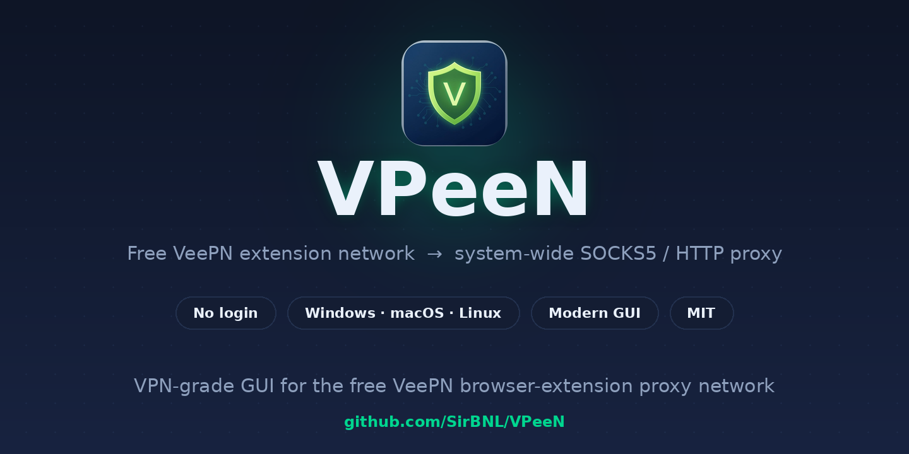
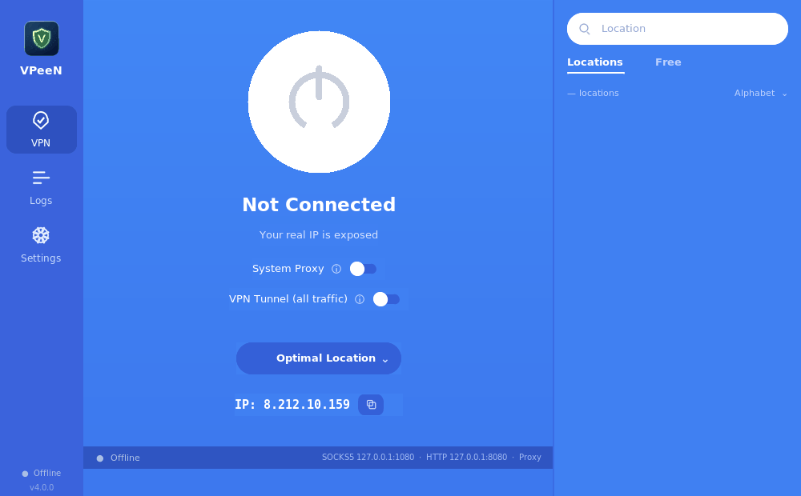
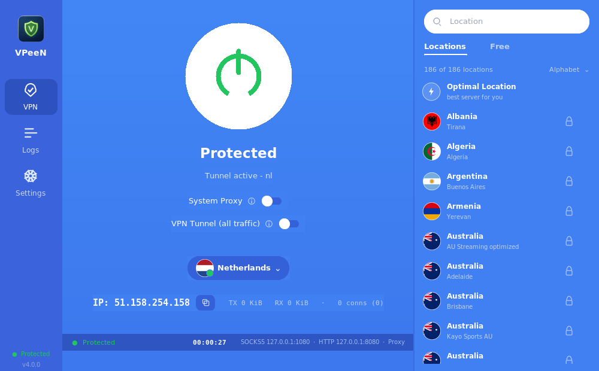
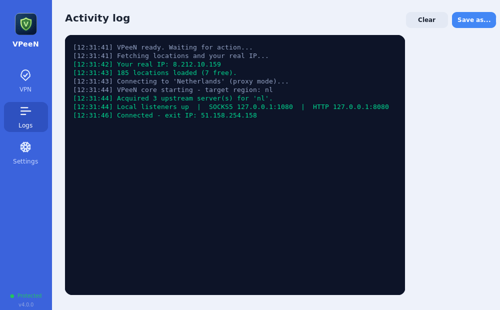
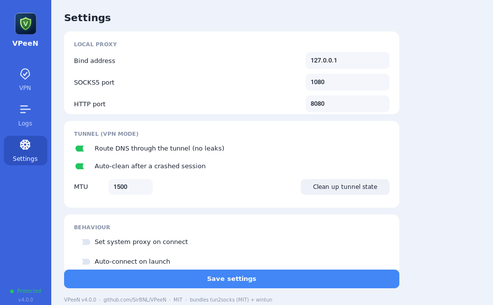

<div align="center">



# 🛡️ VPeeN

**The free VeePN browser-extension network — for your entire operating system.**

**شبکه رایگان افزونه VeePN — این بار برای کل سیستم‌عامل تو.**

No login · No subscription · No browser needed

[](LICENSE)
[](#-quick-start)
[](https://www.python.org/)
[](../../releases)
[](../../stargazers)



</div>

---

## 💡 Why VPeeN?

The VeePN Chrome extension is free, needs no account, and tunnels browser traffic through a
global proxy network. **VPeeN** speaks the same protocol natively and brings those tunnels to
every app on your machine — wrapped in a clean, modern desktop interface.

- 🖥️ **System-wide** — browsers, games, download managers, CLIs: everything is covered
- 🙈 **Anonymous** — guest tokens only, nothing to sign up for
- 🚪 **Browser-free** — Chrome can stay closed; VPeeN talks to the network directly
- 🧩 **Standard interfaces** — plain SOCKS5 and HTTP proxies on localhost


## ✨ Features

| | Feature | Details |
|---|---|---|
| ⚡ | **One-click connect** | A big, honest power button with a live pulse while working |
| 🌍 | **Location picker** | Flag-tagged list of all 185 locations, live search, *Free* tab, *Fastest* sort |
| 🔒 | **Real VPN Tunnel (TUN)** | Hiddify-style full-system tunnel — every app, zero config (see below) |
| 🖥️ | **System proxy mode** | Classic SOCKS5/HTTP mode with a one-switch OS setup + restore |
| 🎲 | **IP roll animation** | Watch your IP digits spin and settle on the new one |
| 🕵️ | **IP monitor** | Real IP when offline, exit IP when protected — one click to copy |
| ⏱️ | **Session timer** | Exactly how long you have been protected |
| 🛡️ | **DNS leak protection** | In tunnel mode DNS is relayed through the tunnel itself |
| 📜 | **Activity log** | Color-coded, autoscrolling, exportable to a file |
| ⚙️ | **Settings** | Ports, tunnel MTU, DNS relay, auto-connect, crash cleanup |
| 🔁 | **Self-healing tunnels** | Round-robin across servers, automatic retry on failure |
| 📦 | **Zero runtime deps** | The core engine is pure Python standard library |

<div align="center">

| Connect | Logs | Settings |
|:---:|:---:|:---:|
|  |  |  |

</div>

## 🚀 Quick Start

### Option 1 — Ready-made binaries

Download from [**Releases**](../../releases):

| File | OS | Run |
|---|---|---|
| `VPeeN-Windows.zip` | Windows 10/11 | unzip → `VPeeN.exe` |
| `VPeeN-macOS.zip` | macOS 10.13+ | unzip → `VPeeN.app` *(right-click → Open, the first time)* |
| `VPeeN-Linux.tar.gz` | Linux x64 | extract → `./VPeeN` |

> Linux tip: if fonts look odd in the bundled build, prefer Option 2 — running from source
> uses your system's font stack and looks perfect.

### Option 2 — Run from source

```bash
git clone https://github.com/SirBNL/VPeeN.git
cd VPeeN
pip install -r requirements.txt
python main.py
```

The app starts, shows your real IP, fetches free locations — press the power button.

### Option 3 — Headless CLI

No GUI needed (servers, routers, scripts):

```bash
python -m vpeen.cli list                 # list free locations
python -m vpeen.cli test nl              # full chain test: token → server → exit IP
python -m vpeen.cli run --region us-va   # SOCKS5 :1080 + HTTP :8080
python -m vpeen.cli run --best           # auto-pick the optimal region
python -m vpeen.cli export nl            # print the raw upstream config
```

Then point any app at:

```
SOCKS5 :  socks5://127.0.0.1:1080
HTTP   :  http://127.0.0.1:8080
```

## ⚙️ How it works

VPeeN reproduces what the free VeePN extension does inside the browser — but for the whole OS:

1. **Anonymous session** — VPeeN obtains a guest access token, exactly like the extension.
   No account is ever created.
2. **Locations & servers** — the free location list and per-session credentials are fetched
   from VeePN's live infrastructure, so the app keeps working as endpoints evolve.
3. **Local proxy** — VPeeN listens as a standard SOCKS5 + HTTP proxy on `127.0.0.1`.
4. **Tunneling** — every connection is relayed through an encrypted tunnel to the selected region.
5. **System switch** — optionally flips the OS proxy on (Windows / macOS / GNOME) and restores
   the previous state on exit.

## 🔒 Tunnel Mode — a real VPN, the Hiddify way

Flip the **VPN Tunnel (all traffic)** switch and VPeeN stops being "just a proxy" and becomes
a **system-wide VPN**: a virtual network adapter takes over all of your traffic — not just the
apps that know about proxies.

```mermaid
flowchart LR
    A["🖥️ ALL apps + DNS"] --> B["🔌 VPeeN TUN adapter"]
    B --> C["tun2socks userspace TCP/IP stack"]
    C -->|"socks5 over loopback"| D["VPeeN core"]
    D -->|"encrypted tunnel"| E["🌍 VeePN network"]
    E --> F["Internet"]
    style D fill:#3e7af4,color:#ffffff,stroke:#3e7af4
    style A fill:#141d33,color:#eaf1fb,stroke:#22304d
    style B fill:#141d33,color:#eaf1fb,stroke:#22304d
    style C fill:#141d33,color:#eaf1fb,stroke:#22304d
    style E fill:#141d33,color:#eaf1fb,stroke:#22304d
    style F fill:#141d33,color:#eaf1fb,stroke:#22304d
```



Under the hood this is the same architecture Hiddify / sing-box use: a TUN device
([wintun](https://www.wintun.net/) on Windows, `utun` on macOS, `tun` on Linux) driven by the
open-source [tun2socks](https://github.com/xjasonlyu/tun2socks) engine (MIT), which VPeeN
launches as a properly elevated helper and points at its own local SOCKS5.

### Built to never break your internet

| Safety mechanism | What it means for you |
|---|---|
| 🚫 **No route hijack** | VPeeN adds two `/1` routes instead of replacing your default gateway — disconnect = instant, clean restore |
| 🧭 **Anti-loop routes** | The VPN servers themselves are pinned to your real gateway, so the tunnel can never route into itself |
| 🏠 **LAN stays up** | Local network traffic (printers, NAS, router admin) is untouched |
| 📡 **DNS through the tunnel** | The TUN adapter's DNS points at VPeeN's internal relay — your system DNS settings are never modified |
| 💓 **Heartbeat watchdog** | If the GUI dies, the elevated helper notices within seconds and tears everything down |
| 🧹 **Crash journal** | Every route change is journaled to disk; after a hard crash the next launch cleans up automatically |
| ♻️ **Adapter auto-removal** | The wintun adapter lives only as long as the process — kill anything, Windows cleans itself |

> ℹ️ Tunnel mode needs **administrator rights once per connect** (UAC prompt on Windows,
> pkexec / osascript on Linux / macOS) — that is how real VPN apps create a network device.
> Everything else (proxy mode) works without elevation.

| | Proxy mode | 🔒 Tunnel mode |
|---|---|---|
| Coverage | Apps that use the OS proxy / SOCKS5 | **Every app, every protocol (TCP)** |
| Admin rights | not needed | once per connect (UAC) |
| DNS | resolved by your system | relayed through the tunnel |
| Best for | browsers, quick use | full protection, stubborn apps, games |

## 🏗️ Build from source

```bash
pip install pyinstaller
pyinstaller vpeen.spec --noconfirm
```

- **Windows** → `dist/VPeeN.exe`  ·  **macOS** → `dist/VPeeN.app`  ·  **Linux** → `dist/VPeeN`

Every push is built for all three platforms by [GitHub Actions](.github/workflows/build.yml);
version tags (`v*`) automatically produce a [release](../../releases) with binaries.

## 📁 Project structure

```
VPeeN/
├── main.py               # GUI launcher
├── vpeen/
│   ├── gui.py            # CustomTkinter interface (hero / location panel / logs / settings)
│   ├── core.py           # background proxy engine + GUI event bridge
│   ├── api.py            # VeePN network client (tokens, locations, servers)
│   ├── upstream.py       # encrypted upstream tunnels
│   ├── localproxy.py     # local SOCKS5 + HTTP servers
│   ├── tunnel.py         # VPN tunnel orchestration (elevated worker + controller)
│   ├── tunnel_platforms.py  # per-OS TUN routes / DNS / session journal
│   ├── dnsrelay.py       # DNS relay that tunnels DNS through VPeeN
│   ├── systemproxy.py    # OS proxy switch (Win / macOS / GNOME)
│   ├── settings.py       # persistent app settings
│   ├── cli.py            # headless command-line mode
│   └── utils.py          # shared helpers
├── assets/               # icon, logo, banner, flags/ (92 circular flags)
├── scripts/fetch-binaries.py  # pinned download of tun2socks + wintun (build-time only)
├── docs/                 # screenshots + demo GIF
└── .github/workflows/    # multi-OS build + release pipeline
```

## 🧾 Third-party components

| Component | License | Usage |
|---|---|---|
| [tun2socks](https://github.com/xjasonlyu/tun2socks) v2.7.0 | **MIT** | TUN engine for Tunnel mode (fetched at build time, never at runtime) |
| [wintun](https://www.wintun.net/) 0.14.1 | Wintun Prebuilt Binaries License | signed virtual-adapter driver (Windows, used via its permitted API) |
| [CustomTkinter](https://github.com/TomSchimansky/CustomTkinter) | MIT | UI framework |
| Flags | [flagcdn](https://flagcdn.com/) (public domain) | circular country flags |

## ❓ FAQ

<details>
<summary><b>Is an account or subscription required?</b></summary>
No. VPeeN uses the same anonymous guest-token flow as the free browser extension.
</details>

<details>
<summary><b>Which locations are free?</b></summary>
Currently 7 free locations (Amsterdam, Paris, London, Virginia, Oregon, Singapore, Saint Petersburg).
The app fetches the live list — run <code>python -m vpeen.cli list</code> to see it.
</details>

<details>
<summary><b>Is this a "real" VPN?</b></summary>
With <b>Tunnel mode</b> — yes: a virtual network adapter routes all of your system's TCP traffic
through the VPN tunnel with DNS leak protection, exactly like Hiddify/sing-box do it.
In classic proxy mode it is a system-wide SOCKS5/HTTP proxy (no UDP). QUIC/UDP flows fall back
to TCP automatically in tunnel mode.
</details>

<details>
<summary><b>Where is my data stored?</b></summary>
Only <code>~/.vpeen/</code> on your machine — cached token, servers and settings. Nothing is sent anywhere else.
</details>

<details>
<summary><b>Antivirus flags the binary?</b></summary>
PyInstaller onefile builds are sometimes heuristically flagged. Build from source with
<code>pyinstaller vpeen.spec</code> if you prefer — the code is fully readable right here.
</details>

## ⚠️ Disclaimer

This project is published **for educational and research purposes** — it demonstrates how a
browser-extension proxy client works. Using the free extension network outside the browser may
conflict with VeePN's Terms of Service; you are responsible for how you use this software.
Respect the laws of your country and the networks you connect to.

---

<div align="center" dir="rtl">

# 🇮🇷 راهنمای فارسی

**VPeeN** همون شبکه‌ای رو که افزونه رایگان VeePN توی مرورگر در اختیارت می‌ذاره، برای
**کل سیستم‌عامل** باز می‌کنه — با یک رابط گرافیکی تمیز و مدرن، بدون ثبت‌نام و بدون نیاز به کروم.

## ✨ ویژگی‌ها

- ⚡ **اتصال با یک کلیک** — دکمه پاور بزرگ با انیمیشن پالس زنده
- 🌍 **انتخاب موقعیت** — لیست هر ۱۸۵ لوکیشن با پرچم کشور، جستجوی زنده، تب «رایگان» و مرتب‌سازی «سریع‌ترین»
- 🔒 **تانل واقعی VPN (حالت TUN)** — تانل کامل مثل Hiddify؛ کل ترافیک سیستم بدون هیچ تنظیماتی
- 🖥️ **حالت پروکسی سیستم** — SOCKS5/HTTP کلاسیک با ست/بازیابی خودکار پروکسی سیستم‌عامل
- 🎲 **انیمیشن تغییر IP** — ارقام IP موقع اتصال می‌چرخند و روی IP جدید می‌ایستند
- 🕵️ **مانیتور IP** — زمان قطع: IP واقعی تو؛ زمان اتصال: IP خروجی — با یک کلیک کپی می‌شه
- ⏱️ **تایمر جلسه** — دقیقاً می‌گه چقدره که محافظت می‌شی
- 🛡️ **ضد نشت DNS** — در حالت تانل، خود DNS هم از داخل تانل رد می‌شه
- 📜 **لاگ کامل فعالیت** — رنگی، اسکرول خودکار، قابل ذخیره در فایل
- ⚙️ **تنظیمات** — پورت‌ها، MTU تانل، رله DNS، اتصال خودکار، پاک‌سازی بعد از کرش
- 🔁 **تانل خودترمیم** — توزیع بار بین سرورها و تلاش مجدد خودکار

## 🔒 حالت تانل — یک VPN واقعی، مثل Hiddify

کلید **VPN Tunnel (all traffic)** رو بزن تا VPeeN از «فقط یک پروکسی» به یک **VPN سراسری واقعی** تبدیل بشه:
یک کارت شبکه مجازی کل ترافیک سیستم رو می‌گیره — حتی برنامه‌هایی که مفهوم پروکسی رو نمی‌فهمن.

همون معماری Hiddify و sing-box: آداپتور TUN ([wintun](https://www.wintun.net/) در ویندوز، `utun` در مک،
`tun` در لینوکس) که با موتور متن‌باز [tun2socks](https://github.com/xjasonlyu/tun2socks) (مجوز MIT) راه می‌افته.

### طوری ساخته شده که اینترنتت رو خراب نکنه

| مکانیزم امنیتی | یعنی چی؟ |
|---|---|
| 🚫 **بدون دستکاری روپ پیش‌فرض** | به‌جای عوض‌کردن گیت‌وی سیستم، فقط دو مسیر `/1` اضافه می‌شه؛ قطع اتصال = برگشت فوری و تمیز |
| 🧭 **مسیر ضد حلقه** | IP سرورهای VPN به گیت‌وی اصلی قفل می‌شن تا تانل هیچ‌وقت داخل خودش نیافته |
| 🏠 **شبکه محلی سالم می‌مونه** | ترافیک LAN (پرینتر، NAS، پنل مودم) دست‌نخورده |
| 📡 **DNS از داخل تانل** | DNS آداپتور مجازی به رله داخلی VPeeN اشاره می‌کنه؛ تنظیمات DNS سیستم تو هیچ‌وقت عوض نمی‌شه |
| 💓 **نگهبان ضربان** | اگه رابط گرافیکی بمیره، هلپر elevated ظرف چند ثانیه همه‌چیز رو برمی‌گردونه |
| 🧹 **ژورنال کرش** | تک‌تک تغییرات مسیرها روی دیسک ثبت می‌شه؛ بعد از کرش سخت، اجرای بعدی خودش پاک می‌کنه |
| ♻️ **حذف خودکار آداپتور** | آداپتور wintun فقط تا وقتی پروسه‌اش زنده‌ست وجود داره |

> ℹ️ حالت تانل به **دسترسی ادمین (یک بار در هر اتصال)** نیاز داره (UAC در ویندوز) — همین قانون برای همه VPN های واقعی برقراره. حالت پروکسی بدون هیچ دسترسی خاصی کار می‌کنه.

| | حالت پروکسی | 🔒 حالت تانل |
|---|---|---|
| پوشش | برنامه‌هایی که پروکسی سیستم رو می‌فهمن | **تمام برنامه‌ها (TCP)** |
| دسترسی ادمین | لازم نیست | یک بار در هر اتصال |
| DNS | با DNS خود سیستم | از داخل تانل |
| مناسب برای | مرورگر، استفاده سریع | محافظت کامل، برنامه‌های سرسخت |

## 🚀 نصب و اجرا

**روش ۱ — فایل آماده:** از [Releases](../../releases) نسخه سیستمت رو بگیر:

| فایل | سیستم‌عامل | اجرا |
|---|---|---|
| `VPeeN-Windows.zip` | ویندوز ۱۰/۱۱ | باز کن → `VPeeN.exe` |
| `VPeeN-macOS.zip` | مک ۱۰.۱۳+ | باز کن → `VPeeN.app` *(بار اول راست‌کلیک → Open)* |
| `VPeeN-Linux.tar.gz` | لینوکس ۶۴بیتی | باز کن → `./VPeeN` |

**روش ۲ — اجرا از سورس:**

```bash
git clone https://github.com/SirBNL/VPeeN.git
cd VPeeN
pip install -r requirements.txt
python main.py
```

**روش ۳ — خط فرمان (بدون رابط گرافیکی):**

```bash
python -m vpeen.cli list                  # لیست لوکیشن‌های رایگان
python -m vpeen.cli test nl               # تست کامل زنجیره
python -m vpeen.cli run --region us-va    # SOCKS5 :1080 + HTTP :8080
python -m vpeen.cli export nl             # نمایش کانفیگ خام آپ‌استریم
```

بعد هر برنامه‌ای رو به این آدرس‌ها وصل کن:

```
SOCKS5 :  socks5://127.0.0.1:1080
HTTP   :  http://127.0.0.1:8080
```

## ❓ سوالات متداول

<details>
<summary><b>نیاز به ثبت‌نام یا خرید اشتراک هست؟</b></summary>
نه. VPeeN دقیقاً مثل افزونه رایگان، توکن مهمان ناشناس می‌گیره. هیچ حسابی ساخته نمی‌شه.
</details>

<details>
<summary><b>کدوم لوکیشن‌ها رایگانه؟</b></summary>
الان ۷ لوکیشن رایگانه (آمستردام، پاریس، لندن، ویرجینیا، اورگن، سنگاپور، سن‌پترزبورگ).
لیست زنده رو خود اپ می‌گیره.
</details>

<details>
<summary><b>VPN واقعیه؟</b></summary>
با <b>حالت تانل</b> — آره: یک کارت شبکه مجازی کل ترافیک TCP سیستم رو با حفاظت نشت DNS از تانل رد می‌کنه،
دقیقاً مثل Hiddify و sing-box. در حالت پروکسی کلاسیک، یک پروکسی سراسری SOCKS5/HTTP داری.
</details>

<details>
<summary><b>اطلاعاتم کجا ذخیره می‌شه؟</b></summary>
فقط در <code>~/.vpeen/</code> روی سیستم خودت: توکن کش‌شده، سرورها و تنظیمات.
</details>

## ⚠️ سلب مسئولیت

این پروژه با هدف **آموزش و پژوهش** منتشر شده و نشان می‌دهد کلاینت پروکسی یک افزونه مرورگر چطور کار می‌کند.
استفاده از شبکه رایگان افزونه خارج از مرورگر ممکن است با شرایط استفاده VeePN در تضاد باشد؛ مسئولیت نحوه استفاده با شماست.
قوانین کشور خودتان را رعایت کنید.

</div>

---

<div align="center">
<br/>
<b>⭐ If VPeeN saved you some money, a star is the best thank-you.</b><br/>
<a href="../../stargazers"></a>
</div>
